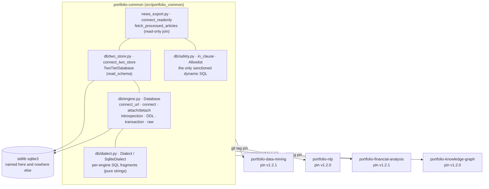

# SPEC.md — `portfolio-common`

Part of the thesis *"Sistema inteligente para la optimización de la inversión
en portafolios mediante integración de información financiera estructurada y
no estructurada de acciones del S&P500"* — Gabriel Jaime Múnera González &
Dovaribi Carupia Yagari, Universidad Pontificia Bolivariana (UPB). Referred
to elsewhere in this document and the architecture artifacts by its working
nickname, "Portfolio Thesis."

The technical contract for this repository: requirements, architecture, data
model, and acceptance criteria. Where `.specify/memory/constitution.md` is
the philosophy/principles/code-style layer this repo commits to regardless of
feature, this document is the "what, precisely" layer for the system it
implements — every requirement below should be traceable to a test, and every
design decision should be explainable by a principle in the constitution.
Link liberally: a design choice justified by, e.g., the constitution's
Architecture or Security & Data principles is annotated `(constitution: …)`
below rather than re-argued here.

Requirement IDs (`FR-0xx` functional, `NR-0xx` non-functional) are stable —
don't renumber an existing one, even if it's later superseded; mark it
superseded in place instead. Reference them in commits/PRs/tests
(`test_engine.py::test_attach_readonly_rejects_stale_wal  # FR-003`) so a
reviewer can trace implementation back to requirement and requirement back to
test.

---

## 1. Overview & Purpose

`portfolio-common` is the shared database layer of a six-repository system
(the "Portfolio Thesis") that builds and maintains an S&P 500 portfolio on top
of a knowledge graph. Data flows in one direction through the system:

```
sources (Wikipedia/news/Finnhub/SEC EDGAR)
  → portfolio-data-mining      (acquisition: discovers URLs, extracts article text)
  → portfolio-nlp              (semantic layer: sentiment/NER/category/summaries)
  → portfolio-financial-analysis (fundamentals/pricing/cycle/quant → SEMANTIC score input)
  → portfolio-knowledge-graph   (RDF/OWL projection + SPARQL evidence surface)
  → portfolio-reports           (as-of run engine, per-name evidence, HTML report)
  → portfolio-app                (thin Streamlit client)
```

with one feedback edge running back up (a user-defined decision criterion,
compiled once in `reports` and propagated into `financial-analysis` and the
knowledge graph) — out of scope for this repo, noted here only for context.

**THIS REPO is not a stage in that flow.** It is the library underneath four
of those boxes: each one pins `portfolio-common` by git tag and opens every
database connection through it. Nothing flows *through* this repo — no data,
no schedule, no process. It ships code, and a git tag is how it ships.

**What this repo is for**: the six repos above all talk to SQLite, and before
`v1.0.0` they did it four different ways — four `sqlite3.connect` recipes with
four different pragma policies (one of them missing `busy_timeout`/WAL/FK
entirely), ~10 hand-written `# noqa: S608` justifications for interpolated
SQL, and a `",".join("?" * len(x))` re-implemented in five places. This repo
exists so that **exactly one place in the system names a database engine**:
connection lifecycle and pragma policy (`Database`), the per-engine SQL
fragments consumers would otherwise write inline (`Dialect`), the two
sanctioned ways to build dynamic SQL text (`in_clause`, `Allowlist`), the
two-tier writable-primary/read-only-secondary topology (`two_store`), and the
single read join two separate repos genuinely share (`news_export`). A future
engine swap is then a new `Dialect` plus a registered `connect_url` scheme
**here**, and a tag bump everywhere else.

**What this repo is explicitly not**: it owns no schema, no table, no
migration history, and no business logic — `v1.0.0` deliberately pushed all
three domains it had accumulated (`kg_schema`, `news_nlp`, the urls.db
pipeline + S&P 500 universe helpers) back out to the repos that own them
(constitution: Project structure #1-2). It is not an ORM, not a query builder,
and not a migrations framework. It reads no environment variable, runs no
process, and exposes no service. It has no AI component (constitution: AI
behavior #1).

## 2. Scope & Requirements

### 2.1 In scope

- One connection class (`Database`) subsuming every connect recipe in the
  system: pragma policy, read-only mode, URL/path dispatch, ATTACH/DETACH
  with a stale-WAL preflight, schema introspection + DDL, transactions.
- The engine-agnostic seam: `Dialect` (Protocol) + `SqliteDialect` +
  `get_dialect`, so no consumer writes engine-specific SQL text or
  `import sqlite3`.
- Injection-safety primitives: `in_clause` (placeholder groups) and
  `Allowlist` (the only sanctioned way to interpolate an identifier).
- The two-tier topology helper (`connect_two_store` / `TwoTierDatabase`).
- `news_export` — the one read contract shared by two repos that
  interoperate through the news-NLP results schema.
- `business_folders/` as a **temporary** staging area for domain code
  awaiting relocation into its owning repo (FR-012) — in scope only until
  each owner has adopted it, then deleted.

### 2.2 Out of scope

- Any business/domain logic or schema ownership — one owner per domain
  (`portfolio-data-mining`, `portfolio-nlp`, `portfolio-financial-analysis`
  own their own tables, DDL, and migrations); `news_export` is the single,
  deliberate exception and is read-only.
- A second database engine implementation (the *seam* is in scope; a
  PostgreSQL/DuckDB `Dialect` is not — none exists, see §13 item 5).
- An ORM, a query builder, a migrations framework, connection pooling, or
  async/`aiosqlite` support.
- Environment/config resolution (`DATABASE_URL` lookup is the consumer's
  job; a resolved path or URL arrives as an argument).
- Publication to PyPI, or any distribution mechanism other than a git tag.

### 2.3 Functional requirements

| ID | Requirement | Acceptance criteria |
|---|---|---|
| **FR-001** | `Database.connect(path, …)` applies one shared pragma policy for the whole system: `row_factory = sqlite3.Row` always; `busy_timeout_ms` (default 30 000) always on a writable connection; `wal=True` also sets `journal_mode=WAL` + `synchronous=NORMAL`; `foreign_keys=True` sets `PRAGMA foreign_keys=ON`; parent directories created unless `create_parents=False`. | A connection opened with defaults reports the configured `busy_timeout`; `wal=True` reports `journal_mode=wal`; `foreign_keys=True` enforces a declared FK (an offending `INSERT` raises); a path in a non-existent directory is openable without the caller pre-creating it. |
| **FR-002** | `read_only=True` opens `file:{path}?mode=ro` via URI and applies **no** write-oriented pragmas and no directory creation (nothing to retry or enforce on a connection that cannot write); every other flag is ignored. | A `read_only=True` connection raises on any write statement; no directory is created for a non-existent parent; rows still come back as `Row`. |
| **FR-003** | `Database.connect_url(url)` is the single connect entry point a consumer's own `connect()` calls, dispatching on scheme: a filesystem path, a `file:` URI (handed through untouched), or `sqlite:///path`. A Windows drive letter (`"D:/thesis/nlp.db"`) is a path, not a `d:` URL; an unknown `scheme://` raises `ValueError`; the target is always opened `uri=True` so a later read-only `ATTACH` is honored. | `_split_url` returns `("sqlite", …)` for a bare path, a `PathLike`, `sqlite:///rel.db`, `sqlite:////abs.db`, `D:/win.db`, and a `file:…?mode=ro` URI; `postgresql://…` raises `ValueError` naming the unsupported scheme and the known ones. |
| **FR-004** | `attach(path, alias, read_only=True)` attaches a second schema, validating *alias* against a plain-identifier regex, and — for a read-only attach — first runs a **stale-WAL preflight**: a non-empty `-wal` sidecar raises `RuntimeError` with a fix-it message rather than silently serving pre-WAL data a read-only connection cannot replay. A failed `ATTACH` is re-raised as `RuntimeError` naming path, alias and cause. `detach(alias)` is the inverse and raises if the alias isn't attached (conditional attachers track that themselves — `TwoTierDatabase`). | A non-identifier alias raises `ValueError` before any SQL runs; a fixture DB with a non-empty `-wal` file raises `RuntimeError` mentioning the WAL path; after `attach`, a table in the attached file is readable as `alias.table` and unwritable. |
| **FR-005** | Runtime schema introspection and DDL live on `Database`, so no consumer hand-writes `PRAGMA table_info` or `executescript`: `table_columns` (definition order, `[]` for a missing table, optional attached `schema=`), `table_exists`, `ensure_columns` (additive, no-op when current), `create_schema(ddl)`, `copy_row_lean` (cross-schema `INSERT … SELECT` over the column intersection, cached per `(dest, source, exclude)`). | `table_columns` returns `[]` for an absent table and the declared order for a present one; `ensure_columns` adds only missing columns and is idempotent on a second call; `copy_row_lean` copies the intersection and omits excluded columns; a non-identifier table/schema name raises `ValueError`. |
| **FR-006** | Catalog and schema-version access are engine-neutral methods, replacing hand-written `sqlite_master` queries and the `try: execute(…) except OperationalError` "is this relation present" idiom: `relation_exists`, `relation_kind` (`"table"`/`"view"`/`None`), `relation_ddl` (stored `CREATE` text), plus `schema_version` / `set_schema_version(n)` over `PRAGMA user_version`. | `relation_kind` distinguishes a table from a view and returns `None` for neither; `relation_ddl` returns the stored `CREATE` text and `None` for an absent relation; `set_schema_version(n)` then `schema_version` round-trips `n`. |
| **FR-007** | `Dialect` (Protocol) + `SqliteDialect` expose every engine-specific SQL fragment the consumers used to write inline — `placeholder` / `placeholders(n)`, `insert` / `insert_or_ignore` / `upsert` / `insert_or_ignore_select`, `year_expr` / `year_month_expr` / `week_start_expr` / `week_end_expr` (Monday-start ISO week) / `current_date_expr` (UTC), `group_concat`, `excludes_bare_digit`, `json_extract` / `json_each`, `autoincrement_pk` — and `get_dialect(name="sqlite")` returns the one implementation. It is a **pure string builder**: it holds no connection and performs no identifier safety of its own (that stays the caller's job via `Allowlist`). | `SqliteDialect` emits byte-for-byte the strings the consumers previously inlined (the adoption PRs were pure refactors, asserted per fragment in `test_dialect.py`); `placeholders(0)` raises `ValueError`; `get_dialect("postgres")` raises rather than silently returning the SQLite one. |
| **FR-008** | `Dialect.upsert` covers all three write-conflict forms a consumer needs: default → `INSERT OR REPLACE` (SQLite whole-row replace), `update=[cols]` → `ON CONFLICT (conflict) DO UPDATE SET c = excluded.c` (portable in-place update), `do_nothing=True` → `ON CONFLICT (conflict) DO NOTHING`. | Each form emits the documented SQL and round-trips against a real table: `update=` leaves unnamed columns intact, `do_nothing=True` leaves the existing row untouched, the default replaces the whole row. |
| **FR-009** | `in_clause(values)` returns a `(?, ?, …)` group sized to the input, and `Allowlist(*names).check(name)` returns the name or raises `ValueError` — together the **only two sanctioned ways** to build dynamic SQL text anywhere in the system (values bound as parameters, identifiers allowlisted). | `in_clause` sizes to the sequence and is paired with the same values bound at every call site; `Allowlist.check` raises on any name outside the fixed set, supports `in` and iteration, and a `DROP TABLE`-shaped string passed as a value reaches the DB as a literal, never as SQL. |
| **FR-010** | `connect_two_store(primary, secondary, *, alias="source", factory=TwoTierDatabase, **connect_kwargs)` opens a writable primary and, unless *secondary* resolves to the same file, `ATTACH`es it read-only, returning `(db, read_schema)` where `read_schema` is the attached alias or `"main"`. `TwoTierDatabase` tracks `read_schema` and `detach` is safe whether or not the attach happened. | Same-file input short-circuits to `("main")` with no ATTACH; distinct files return the alias and expose the secondary's tables as `alias.table`, read-only; `detach` on the non-attached case does not raise; the returned object is a `Database` subclass carrying `read_schema`. |
| **FR-011** | `portfolio_common.news_export` provides `connect_readonly(source_db, results_db)` (a thin shape over `connect_two_store` with the argument order and `(db, "source"\|"main")` return its two consumers expect) and `fetch_processed_articles(db, articles_rel, limit=None)` — the `articles ⋈ article_sentiment ⋈ article_category` join restricted to `fetch_status = 'ok'`, ordered by `id`, as one flat row per article. `articles_rel` is `Allowlist`-checked (`"main"`/`"source"` only) and `limit` is bound, never interpolated. | The join returns exactly the documented columns (`id, ticker, pub_date, fetched_at, body_text, positive, negative, sent_processed_at, cat_label, cat_score, cat_processed_at`); an article missing either result row is absent; a `fetch_status != 'ok'` article is absent; an arbitrary `articles_rel` raises `ValueError`; `limit` caps the row count. |
| **FR-012** | `business_folders/<domain>/` stages domain code for relocation into the one repo that owns it, with that repo named in its own `README.md`, its own `tests/`, and no import from `src/`. It is **temporary by contract**: once the owning repo has adopted it, the copy here is deleted. | **Resolved (2026-09-12).** All three owners adopted, the staged copy had diverged from every adopted file, and it has now been deleted per its own contract — `git ls-files business_folders` is empty. The wheel-exclusion half of the acceptance criterion is now an active CI assertion (§13 item 2 / NR-005) rather than an unchecked property. |

### 2.4 Non-functional requirements

| ID | Requirement | Acceptance criteria |
|---|---|---|
| **NR-001** | Zero runtime dependencies. `[project].dependencies` is `[]`, and stays `[]` — four repos inherit this library transitively and get no say in a version pinned here (constitution: Technological stock #2). | `pyproject.toml` declares no runtime dependency; `uv sync` installs only the dev group; the package imports with nothing but the stdlib available. |
| **NR-002** | The database engine is named in exactly one place in the system. Inside this repo, `import sqlite3` appears only in `db/engine.py` and `db/two_store.py`; in every consumer repo it appears nowhere at all. | `grep -rn "import sqlite3" src` returns those two files and no others; the same grep over each consumer's `src`/`apps`/`cli` returns nothing (verified by hand in each adoption PR — not yet automated, §13 item 7). |
| **NR-003** | The test suite is hermetic: no network, no database server, no fixture files checked in — every test builds its SQLite file under `tmp_path`. | `uv run pytest` passes with no outbound connection and no external service; a clean checkout needs only `uv sync`. |
| **NR-004** | Every name exported from `portfolio_common.__all__` / `portfolio_common.db.__all__` is a cross-repo contract: additive within a MAJOR, removed or redefined only in a MAJOR, and always with a `CHANGELOG.md` compatibility statement (constitution: Code & Git #4-5). | `v1.1.0`, `v1.2.0` and `v1.2.1` are each additive with the CHANGELOG asserting so, and every pre-1.2 signature and return shape still works; `v1.0.0` is the one MAJOR, a clean break with no shim (an `ImportError` on the removed names, by design). |
| **NR-005** | The package is typed and type-checked: `py.typed` ships so consumers type-check against it, and `mypy` (with `disallow_untyped_defs`/`disallow_untyped_calls`/`warn_return_any`) is clean on `src`. | `uv run mypy --config-file=.code_quality/mypy.ini src` → "no issues found in 7 source files"; `py.typed` is present in the wheel — **asserted by CI since 2026-09-12** (`lint-and-types` job: `uv build --wheel` + a wheel-contents check that every path starts with `portfolio_common/` or is standard dist-info, and that `py.typed` is present), not just true by the accident of `business_folders/` sitting outside `src/` (§13 item 2, resolved). |
| **NR-006** | The "swap the engine in one place" promise has exactly one documented constraint on a future engine: its row factory must satisfy `RowLike` — mapping **and** positional **and** `dict(row)` access. Consumers annotate with `portfolio_common.db.Row`, never `sqlite3.Row`. | `RowLike` is a Protocol covering `__getitem__(int\|str)`, `__iter__`, `keys()`, `__len__`; consumer code annotates `Row`; the constraint is stated in `CHANGELOG.md` v1.2.0 rather than left implicit. (Partially undermined by the `sqlite3`-typed escape hatches — §13 item 4.) |
| **NR-007** | The library must work on both developer and CI platforms: development happens on Windows, CI runs both `ubuntu-latest` and `windows-latest`. Path handling is therefore POSIX-normalized on the way into SQLite (`Path(target).as_posix()`), not left platform-dependent. | `uv run pytest` is green on **both** Windows and Linux — **met as of 2026-09-12** (79 passed, 0 failed on both; `test_engine_agnostic.py::test_split_url_accepts_pathlike` now asserts the documented pass-through behavior, `os.fspath`, rather than a hardcoded POSIX string), and CI's `test` job runs a `windows-latest`/`ubuntu-latest` matrix so a regression is caught — see §13 item 3, resolved. |

## 3. Technology Stack & Architecture Decisions

Full stack and rationale: `.specify/memory/constitution.md` §Technological
stock. Summary for traceability:

- **Runtime**: Python `>=3.12,<3.13`, `uv`-managed (`uv.lock` committed).
- **Dependencies**: none at runtime (NR-001). Dev only: `pytest`,
  `pre-commit`, `ruff==0.16.3`, `mypy`.
- **Engine**: stdlib `sqlite3`, confined to `db/engine.py` + `db/two_store.py`
  (NR-002). SQLite is the only implemented backend.
- **Build/distribution**: `hatchling`, src-layout, ships `py.typed`; **not on
  PyPI** — consumed as a git dependency pinned by tag under
  `[tool.uv.sources]`, so the tag is the release artifact.

Architecture decisions this repo has already made and should not be
re-litigated without a constitution amendment:

- **`Database` composes `sqlite3.Connection`, it does not subclass it.** It
  wraps the connection as `self._conn`, which is what lets a domain subclass
  (`TwoTierDatabase`, `portfolio-nlp`'s `NewsNlpDatabase`) carry ordinary
  instance attributes — the thing `sqlite3.Connection` rejects and the
  pre-1.0 `_Connection(sqlite3.Connection)` subclass existed to work around.
- **`Dialect` is a Protocol and a pure string builder.** It holds no
  connection and does no identifier checking: safety stays `Allowlist`'s job
  at the call site. Keeping the two concerns apart is why the seam could be
  adopted as a pure refactor.
- **One owner per domain, with `news_export` as the single exception.**
  `v1.0.0`'s whole point was that business logic belongs to the repo that
  owns its schema. `news_export` is here because its join is read by a repo
  that does not write the schema (`portfolio-knowledge-graph`) and the
  alternative was a hand-duplicated copy drifting out of sync (`CHANGELOG.md`
  v1.1.0). It is read-only and deliberately narrow — not a precedent.
- **Clean break, no compatibility shim.** No module re-exports the pre-1.0
  `db.connect`/`schema`/`portfolio`/`universe_history`/`errors`/`kg_schema`/
  `news_nlp` names. A consumer bumping to `v1.0.0` gets an immediate
  `ImportError` rather than quietly running against a half-migrated engine.
- **`business_folders/` was staging, not a fourth shipped module** (FR-012) —
  outside `src/`, never imported from `src/`; deleted 2026-09-12 once all
  three owners had adopted their copy (§13 item 1, resolved).

## 4. System Architecture



**Reading this diagram**: solid arrows are real, current dependencies — the
four consumer repos each resolve `portfolio-common` through a git tag in
`[tool.uv.sources]`, and only `engine.py`/`two_store.py` touch `sqlite3`
(NR-002). `dialect.py` and `safety.py` deliberately have no edge to the
engine: they build strings. `business_folders/` (the v1.0.0 staging area for
the three extracted domains) is gone from this diagram as of 2026-09-12 — it
completed its handoff to all three owning repos and was deleted once every
staged file had diverged from the adopted copy (§13 item 1, resolved).
`portfolio-reports` and `portfolio-app` do not exist yet and are not
consumers.

Full detail, with hover tooltips per component: [the repository
artifact](https://claude.ai/code/artifact/a1a5f985-a6b9-4dd1-8e2d-cc1f0d939e2b)
referenced from `CLAUDE.md`. System-level placement of this repo among the
other six: [the architecture
overview](https://claude.ai/code/artifact/d3865a63-2894-4e20-b38a-7e50cf0d4040).

## 5. Data Model

**This repo owns no schema.** There is no DDL, no table, no migration history
and no `build_schema` here — `v1.0.0` moved all of that to the repo that owns
each domain (§3, constitution: Project structure #1). What it owns instead is
a set of *contracts about* other repos' data. Those are the data model:

| Contract | Defined by | What it pins | Consumer obligation |
|---|---|---|---|
| **Pragma policy** | `Database.connect` (FR-001/002) | `row_factory = Row` always; `busy_timeout` 30 000 ms default on writable connections; WAL + `synchronous=NORMAL` opt-in; `foreign_keys` opt-in and per-connection | Open through `connect_url`; don't re-set these pragmas by hand, and don't assume FK enforcement without passing `foreign_keys=True` |
| **Schema qualification** | `attach` / `connect_two_store` (FR-004/010) | the attached alias (`"source"` by default) vs. `"main"`; `read_schema` is the name to qualify reads with | Thread the returned `read_schema` through queries; never hardcode `"source"` |
| **Schema version location** | `schema_version` / `set_schema_version` (FR-006) | `PRAGMA user_version` is where a consumer's schema revision lives | Use these rather than reading the pragma directly |
| **Row access** | `Row` / `RowLike` (NR-006) | mapping **and** positional **and** `dict(row)` access | Annotate with `Row`, never `sqlite3.Row`; don't rely on a narrower access style that a future factory need not support |
| **Dynamic SQL** | `in_clause` / `Allowlist` (FR-009) | values are bound; identifiers are allowlisted; nothing else may be interpolated | Pair `in_clause` with the same values bound; `Allowlist.check` every interpolated identifier |
| **Error surface** | `DatabaseError` (FR-006 context) | the engine-neutral exception to `except` (`= sqlite3.OperationalError` today) | `except DatabaseError`, don't `import sqlite3` for it — and prefer `relation_exists` where the real question is existence |

### The `news_export` read contract

The one place this repo makes a claim about another repo's *columns*. It reads
(never writes) three tables owned by `portfolio-nlp`, and is consumed by
`portfolio-knowledge-graph`'s `etl/news_to_rdf.py`:

| Relation | Columns read | Owner | Behavior if absent |
|---|---|---|---|
| `{main\|source}.articles` | `id`, `ticker`, `pub_date`, `fetched_at`, `body_text`, `fetch_status` | `portfolio-data-mining` (SOURCE), lean copy in `portfolio-nlp`'s RESULTS | the query fails loudly — there is no fallback and no shape validation (contrast `portfolio-nlp`'s own `require_source_text`) |
| `article_sentiment` | `positive`, `negative`, `processed_at` | `portfolio-nlp` | an article without a sentiment row is absent from the result (inner join) |
| `article_category` | `label`, `score`, `processed_at` | `portfolio-nlp` | an article without a category row is absent from the result (inner join) |

Returned shape, as one flat row per article: `id, ticker, pub_date,
fetched_at, body_text, positive, negative, sent_processed_at, cat_label,
cat_score, cat_processed_at` — filtered to `fetch_status = 'ok'`, ordered by
`a.id`, optionally `LIMIT`-ed (bound). `articles_rel` is `Allowlist`-checked
against `{"main", "source"}`, the only two values `connect_readonly` can
produce.

**This contract is unversioned and unenforced.** If `portfolio-nlp` renames a
column in that join, nothing here fails until a consumer runs the query —
accepted at this scale (§13 item 6), and the reason the module's own docstring
forbids growing it beyond what a second repo genuinely needs to read.

Full public-API reference (every method, every `Dialect` fragment):
`README.md`'s module table. Release-by-release compatibility record:
`CHANGELOG.md`.

## 6. Core Workflows

**A consumer opens a connection** (the only sanctioned path):

1. The consumer resolves its own `$DATABASE_URL` (this repo reads no env —
   constitution: Project structure #6) and calls
   `Database.connect_url(url, wal=True, foreign_keys=True)` — or its own
   `Database` subclass's `connect_url`, since `connect`/`connect_url` are
   `classmethod`s returning `cls`.
2. `_split_url` decides scheme vs. path (FR-003), `connect` applies the shared
   pragma policy (FR-001), and the target is opened `uri=True` so a later
   read-only `ATTACH` is honored.
3. Queries go through `execute`/`executemany`/`transaction`; SQL *text* comes
   from the consumer's own `queries.py` using `conn.dialect` fragments
   (FR-007) plus `in_clause`/`Allowlist` (FR-009).

**Two-tier open** (`portfolio-nlp`'s SOURCE/RESULTS, generalized): `
connect_two_store(results, source, alias="source")` → writable primary, and
the secondary attached read-only *unless both resolve to the same file*
(short-circuit). The returned `read_schema` is what reads qualify `articles`
with. Teardown is the consumer's `finally: db.detach(alias); db.close()`;
`TwoTierDatabase.detach` is safe when the attach never happened (FR-010).

**Stale-WAL preflight** (FR-004): before a read-only attach, a non-empty
`-wal` sidecar aborts with a fix-it `RuntimeError` — a read-only connection
cannot replay the log, so the alternative is silently serving stale data.

**Release** (the workflow that actually ships anything here):

1. Land the change on a branch → PR → green CI → merge to `master`.
2. Bump `[project].version` and add the `CHANGELOG.md` section **stating
   compatibility explicitly** (constitution: Code & Git #5).
3. `git tag vX.Y.Z && git push origin vX.Y.Z` — immutable from that moment
   (constitution: Code & Git #10).
4. Each consumer adopts by bumping its own `[tool.uv.sources]` tag, in its own
   PR, on its own schedule. A release is not "rolled out" until it is
   re-pinned — which is why consumers are currently split across `v1.2.0` and
   `v1.2.1` (§13 item 9).

**`business_folders/` adoption** (FR-012): the owning repo copies its folder
into its own `src/`, adapts imports, lands its adoption PR — and the copy
here is then deleted. All three owners completed their adoption PR, and the
deletion half landed 2026-09-12, once every staged file had diverged from
the adopted copy (§13 item 1, resolved) — the directory no longer exists.

## 7. Business Logic & Algorithms

There is no business logic here by design (§1). What exists is engine
mechanics with non-obvious reasoning worth recording:

- **Pragma policy, and why each is per-connection.** `busy_timeout` is not
  persistent, so *every* connection must set it — without it a connection
  that finds the file locked raises `database is locked` immediately instead
  of retrying internally. `foreign_keys` is likewise per-connection: SQLite
  declares FK constraints in the schema but does not enforce them unless the
  pragma is set. `journal_mode=WAL` *is* persistent at the file level, so
  setting it once on the writer is enough. A read-only connection gets none of
  them — there is nothing to retry or enforce.
- **Read-only means URI mode, not a flag.** `read_only=True` opens
  `file:{path}?mode=ro`; that is what makes a write attempt fail at the
  engine rather than relying on discipline.
- **`_split_url`'s scheme heuristic** (FR-003): a `file:` prefix is handed
  through untouched; `sqlite:///` has everything after the fixed prefix taken
  as the path (so `sqlite:////abs` → `/abs`, `sqlite:///D:/win` → `D:/win`);
  a single-letter scheme without `://` is a **Windows drive letter**, not a
  scheme; an unknown multi-letter `scheme://` raises rather than being opened
  as a weirdly-named file. Targets are normalized with `as_posix()` on the way
  into SQLite (NR-007).
- **`copy_row_lean` caches the column intersection** per
  `(dest, source, exclude)` on the connection: a two-tier pipeline calls it
  once per processed row and the column set cannot change mid-connection.
- **`upsert` form selection** (FR-008): the SQLite-only whole-row
  `INSERT OR REPLACE` stays the default for the call sites that were already
  written that way; the portable `ON CONFLICT DO UPDATE/DO NOTHING` forms are
  opt-in per call, so adopting them was a visible, reviewable change per call
  site rather than a silent semantic shift.
- **Identifier validation is a regex, not an `Allowlist`.** Aliases and table
  names reaching `attach`/`table_columns` are validated against
  `^[A-Za-z_][A-Za-z0-9_]*$` because the legitimate set is open-ended
  (a consumer's own table names), where `Allowlist` is for a *fixed* set known
  at the call site. Both raise rather than interpolating anything unchecked.
- **`week_start_expr`/`week_end_expr` are Monday-start ISO weeks**, and
  `current_date_expr` is UTC — stated here because consumers bucket by week
  and a silent locale/offset difference would shift every bucket.
- **`excludes_bare_digit`** emits `NOT GLOB '[0-9]'` — the SQLite spelling of
  a predicate a consumer would otherwise write inline, preserved verbatim so
  the seam's adoption changed no rows.

## 8. Error Handling & Resilience

Governing principle: **fail loudly, never swallow silently** — and, for a
library four repos depend on, fail *at the call that was wrong* rather than
somewhere downstream. Concretely:

- **Stale WAL raises with a fix-it message** (FR-004) rather than serving
  stale data: the failure mode this replaces is silent and data-corrupting,
  which is why it's a preflight and not a warning.
- **A failed `ATTACH` is re-raised as `RuntimeError` naming path, alias and
  the original error** — the common misconfiguration (wrong path, file locked,
  no read permission) is otherwise a bare `OperationalError` with no context.
- **Every interpolated identifier is validated before it reaches SQL text**:
  `ValueError` on a bad alias/table/schema name (regex) or a name outside an
  `Allowlist`. There is no code path that interpolates an unchecked string.
- **`detach` raises if the alias isn't attached** rather than no-oping — a
  caller that attaches conditionally must track that itself, which is exactly
  what `TwoTierDatabase` does. A silent no-op would hide a topology bug.
- **`placeholders(0)` raises** instead of emitting an empty `IN ()` that
  SQLite would reject with a syntax error far from the cause.
- **`DatabaseError` exists so consumers can `except` without importing
  `sqlite3`** — but `relation_exists` exists so that, where the real question
  is "does this relation exist", they don't need an `except` at all.
- **No retry, no reconnect, no circuit breaker.** The only resilience
  mechanism is `busy_timeout` (the engine's own internal retry). A library
  that swallowed and retried on behalf of four callers with different
  transaction semantics would be guessing.

## 9. Performance & Scalability Expectations

This repo has no throughput/latency SLA, and defining one is out of scope
(§14) — it is a thin wrapper over stdlib `sqlite3` with no process of its own,
and any measured number would be the consumer's workload, not this library's.
No benchmark exists and none should be invented.

What *is* enforced by design:

| Knob | Value | Why |
|---|---|---|
| `busy_timeout` | 30 000 ms (`DEFAULT_BUSY_TIMEOUT_MS`) on every writable connection | the system has concurrent writers (pipeline + API); without it a locked file is an immediate error instead of a wait |
| `sqlite3.connect` timeout | 30 s (`_CONNECT_TIMEOUT_S`) | bounded failure on a wedged file rather than an indefinite hang |
| WAL + `synchronous=NORMAL` | opt-in per connection (`wal=True`) | readers don't block the writer where a consumer wants that; not forced on stores that don't |
| `copy_row_lean` column cache | per `(dest, source, exclude)`, per connection | the two-tier pipeline calls it once per row; re-deriving the intersection each time would be a per-row `PRAGMA` |

Scale context, not a target: the consumer workloads this sits under include a
17.6M-row `article_entities` table in `portfolio-nlp`'s RESULTS store. That is
the reason `busy_timeout`/WAL policy is centralized here at all — four repos
getting it slightly differently was the original defect (§1).

## 10. Testing Strategy & Acceptance Criteria

- **Hermetic by construction** (NR-003): every test builds its own SQLite
  file under `tmp_path`. No network, no server, no committed fixture DB, no
  GPU. `tests/` is the one place outside `db/engine.py`/`db/two_store.py`
  allowed to `import sqlite3` — it is testing the engine binding itself.
- **Coverage mapping** (79 tests across 6 files):

| File | Tests | Covers |
|---|---|---|
| `test_engine.py` | 19 | FR-001, FR-002, FR-004, FR-005, FR-006 |
| `test_engine_agnostic.py` | 22 | FR-003 (URL dispatch), FR-005/006 (introspection, catalog, `user_version`), NR-006 |
| `test_dialect.py` | 18 | FR-007, FR-008 |
| `test_safety.py` | 7 | FR-009 |
| `test_two_store.py` | 7 | FR-010 |
| `test_news_export.py` | 6 | FR-011 |

- **New requirement → new test first** — a change implementing or altering an
  FR/NR above should land with a test that references the requirement ID in a
  comment or test name.
- **Acceptance criteria in §2.3/§2.4 are the test spec** — each row should be
  directly expressible as one or more `pytest` assertions; a PR claiming to
  satisfy an FR/NR without a corresponding test is incomplete.
- **The seam's acceptance criterion is behavioral equivalence, not coverage.**
  `SqliteDialect` exists to emit the strings consumers previously inlined, so
  a `Dialect` test asserting the exact SQL string is the point, not a
  brittleness to apologize for — if the string changes, a consumer's rows
  change.
- **A consumer's own suite is part of this repo's acceptance surface.** The
  adoption PRs (143 tests in `portfolio-nlp`, 203 in
  `portfolio-financial-analysis`, 213 in `portfolio-data-mining`) are what
  proves a release didn't change behavior; a breaking change here is only
  really verified downstream.

### Resolved gap: the suite is now green on Windows (2026-09-12)

`uv run pytest` used to be 78 passed / 1 failed on the development platform:
`test_engine_agnostic.py::test_split_url_accepts_pathlike` asserted
`_split_url(Path("/x/y.db")) == ("sqlite", "/x/y.db")`, but `os.fspath` yields
`\x\y.db` on Windows. The *library* was always correct — `connect_url`
normalizes with `Path(target).as_posix()` before handing the target to
SQLite — it was a POSIX-only assertion in the test, not an engine defect.
Fixed by asserting the documented pass-through (`os.fspath`) instead of a
hardcoded POSIX string; `uv run pytest` is now 79 passed, 0 failed on both
platforms, and CI's `test` job runs a `[ubuntu-latest, windows-latest]`
matrix so this class of regression has coverage going forward. See §13 item
3 / NR-007 (`PLAN.md` Work item 3, closed).

## 11. Deployment Procedures

There is nothing to deploy — this repo ships a library, and **the git tag is
the distribution channel** (constitution: Technological stock #4). The
procedure that stands in for deployment:

1. `uv sync` (dev group) and `uv run pre-commit install --hook-type
   pre-commit --hook-type commit-msg --hook-type pre-push`.
2. CI gate before merge (`.github/workflows/ci.yml`, `master`/PRs): two jobs
   — `lint-and-types` (`ubuntu-latest`: `uv sync` → `ruff check .` →
   `ruff format --check .` → `mypy --config-file=.code_quality/mypy.ini src`
   → build the wheel and assert its contents, NR-005) and `test` (a
   `[ubuntu-latest, windows-latest]` matrix: `uv sync` → `pytest -q`,
   NR-007).
3. Bump `[project].version`; add the `CHANGELOG.md` section with an explicit
   compatibility statement; merge.
4. `git tag vX.Y.Z && git push origin vX.Y.Z`. Never move, re-point or delete
   a pushed tag — four repos resolve through it and `uv` caches by tag; a bad
   release is superseded, not rewritten.
5. Per consumer, in its own PR: bump `[tool.uv.sources]`'s tag, run that
   repo's full suite, confirm `grep -rn "import sqlite3" src` is still empty
   (NR-002). A release with no re-pin has shipped to nobody.

For local development against a checkout, a consumer overrides the source
with `portfolio-common = { path = "../portfolio-common", editable = true }` —
useful, and a thing to *remove* before opening a PR, since it pins nothing.

## 12. Dependencies & Integrations

- **Upstream**: none. Stdlib only (NR-001) — this is the bottom of the
  dependency graph, which is the whole reason it can be shared.
- **Downstream (consumers, by current pin on their own `master`)**:
  `portfolio-data-mining` `v1.2.1`, `portfolio-financial-analysis` `v1.2.1`,
  `portfolio-nlp` `v1.2.0`, `portfolio-knowledge-graph` `v1.2.0`. All four
  have adopted the seam; none imports `sqlite3`.
- **Not consumers**: `portfolio-reports` and `portfolio-app` — not created
  yet. When they are, they pin a tag like everyone else.
- **Cross-repo data contract**: `news_export` reads three tables owned by
  `portfolio-nlp` (§5) — the only place this repo depends on another repo's
  column names. Unversioned and unenforced by choice (§13 item 6).
- **External services**: none. No network call exists anywhere in `src/`.
- **Formerly staged, now deleted**: `business_folders/` (FR-012) held code
  *for* three consumers until each had adopted it; deleted 2026-09-12 once
  every staged file had diverged from its owner's adopted copy (§13 item 1).

## 13. Open Questions & Risks

Carried forward from the last recorded architecture review
([the repository artifact](https://claude.ai/code/artifact/a1a5f985-a6b9-4dd1-8e2d-cc1f0d939e2b))
and this document's own drafting — resolve or explicitly accept before
treating a related FR/NR as done:

1. ~~**`business_folders/` has outlived its contract, and every file in it
   had diverged.**~~ **Resolved (2026-09-12).** All three owners had adopted
   (`portfolio-nlp`'s `src/news_nlp/`, `portfolio-financial-analysis`'s
   `src/kg_schema/`, `portfolio-data-mining`'s `src/data_mining/`) and every
   staged file had diverged from its owner's adopted copy; the directory was
   deleted per its own contract (`PLAN.md` Work item 1, closed). Struck
   through and kept here, per this document's no-renumbering convention,
   only so the item number stays stable for anything that already
   references it.
2. ~~**Nothing asserts the wheel excludes `business_folders/`.**~~
   **Resolved (2026-09-12).** CI's `lint-and-types` job now builds the wheel
   and asserts its contents are `portfolio_common/` plus standard dist-info
   only, and that `py.typed` is present — verified to actually gate (a
   deliberate local misconfiguration, adding `tests` to
   `[tool.hatch.build.targets.wheel].packages`, was confirmed to fail the
   check before being reverted). `PLAN.md` Work item 2, closed; see NR-005.
3. ~~**The test suite is red on the development platform and CI can't see
   it**~~ **Resolved (2026-09-12).** `test_engine_agnostic.py::test_split_url_accepts_pathlike`
   now asserts `_split_url`'s documented pass-through behavior (`os.fspath`)
   instead of a hardcoded POSIX string; `uv run pytest` is 79 passed, 0
   failed on both Windows and Linux. CI's `test` job now runs a
   `[ubuntu-latest, windows-latest]` matrix, so this class of regression has
   coverage going forward. `PLAN.md` Work item 3, closed; see NR-007, §10.
4. **The engine name leaks through the public type surface.** `execute`/
   `executemany`/`executescript` are annotated `-> sqlite3.Cursor`, `.raw`
   returns `sqlite3.Connection`, `Row` *is* `sqlite3.Row`, and
   `DatabaseError` *is* `sqlite3.OperationalError`. A consumer that never
   imports `sqlite3` still type-checks against it transitively, so "swap the
   engine in one place" is true for SQL text and connection mechanics but not
   yet for the type signatures. Accepted for now (the alternative is a
   cursor/connection wrapper with its own surface), but it is the real limit
   of NR-002/NR-006 and should be stated rather than implied.
5. **The seam has never been exercised by a second engine.** `Dialect` is a
   Protocol with exactly one implementation and `get_dialect` knows one name.
   Whether the fragment set is the *right* abstraction boundary is therefore
   unproven — the first real non-SQLite `Dialect` is likely to discover
   missing members (type affinity, `RETURNING`, upsert conflict-target
   syntax, date arithmetic beyond the four expressions that exist).
6. **The `news_export` contract is unversioned and unvalidated.** It hardcodes
   eleven column names across three tables owned by `portfolio-nlp` (§5), with
   no shape check and no schema-version assertion. A rename there surfaces as
   a runtime error in `portfolio-knowledge-graph`, not as a failing test here.
7. **NR-002 is enforced by hand.** "No consumer imports `sqlite3`" is
   currently verified by a human running `grep -rn "import sqlite3" src` in
   each adoption PR. Nothing in this repo's CI — and nothing in the
   consumers' — asserts it on an ongoing basis, so the property can regress
   silently in any of four repos.
8. ~~**The repository artifact contradicts itself.**~~ **Resolved
   (2026-09-12).** Its header/engine-seam section was current for `v1.2.1`/
   all-adopted, but its architecture diagram and "Gaps & risks" section
   still said "PR #7 open", "zero of three repos have adopted it", and "the
   `v1.0.0` tag sits ahead of `master`" — all untrue since 2026-09-05. Both
   sections rewritten to match the current rollout state (the staging
   directory shown as adopted-and-stale rather than pending, and the gaps
   list replaced with the live set from this section); the system-wide
   [Portfolio Thesis](https://claude.ai/code/artifact/d3865a63-2894-4e20-b38a-7e50cf0d4040)
   artifact was re-checked in the same pass and found already consistent
   (no edit needed there). `PLAN.md` Work item 4, closed. Neither artifact's
   title changed.
9. **Consumers are split across two tags; the README pin is fixed, the split
   itself stays accepted.** `v1.2.0` (nlp, knowledge-graph) and `v1.2.1`
   (data-mining, financial-analysis) are both live pins — accepted per §14,
   since both releases are additive and staggered adoption is normal.
   **The README half is resolved (2026-09-12):** `README.md`'s "Use it from
   another repo" example now shows `v1.2.1` and points at `CHANGELOG.md` as
   the authority on the current release, so a new reader no longer copies a
   pin one release behind.

## 14. Scope Boundaries (Out of Scope, Not Deferred)

**This repository is a thesis/research artifact. Productizing it is not a
goal of this project and no production phase is planned.** Every requirement
and acceptance criterion above (§2–§13) describes and governs that scope
honestly — nothing above should be read as an implicit production-readiness
claim. The items below are **permanently out of scope as this project is
currently defined**, not a backlog or a roadmap; they exist so a reader
doesn't mistake "not built" for "overlooked."

### What this repo validates

Per §10 and the design rationale in §7, this repo currently validates:

- **Correctness of the engine primitives** — pragma policy, read-only mode,
  URL/path dispatch, ATTACH lifecycle, introspection/DDL, transactions
  (FR-001–FR-006), against real SQLite files.
- **Behavioral equivalence of the seam** — that `SqliteDialect` emits the
  SQL its consumers previously wrote inline, which is what made adoption a
  pure refactor in all four repos (FR-007/008, §10).
- **Injection safety as a mechanism, not a convention** — `in_clause` and
  `Allowlist` are unit-tested primitives replacing ~10 hand-written `noqa`
  justifications, and every interpolation site in this repo goes through one
  of them (FR-009).
- **The two-tier topology's edge cases** — same-file short-circuit,
  read-only enforcement, safe teardown when the attach never happened
  (FR-010).

### What this project explicitly does not do (out of scope)

None of the following exist today, none are assumed by any FR/NR above, and
none are planned — this list is here so that absence reads as a deliberate
boundary of what this project is, not a gap someone forgot to close:

- **A second database engine.** The *seam* is the deliverable; a PostgreSQL
  or DuckDB `Dialect` is not (§13 item 5 records what that would discover).
- **An ORM, query builder, migrations framework, connection pool, or async
  support.** Consumers own their own `queries.py` and their own migrations;
  this library hands them a connection and the strings they'd otherwise
  inline.
- **Config/environment resolution, retries, reconnects, or any policy that
  guesses on a caller's behalf** (§8) — four consumers with different
  transaction semantics is exactly the situation where a shared default is
  wrong.
- **Distribution beyond a git tag**: no PyPI publication, no release
  automation, no semantic-release, no signed artifacts. Tag discipline
  (constitution: Code & Git #10) is the whole release process.
- **Multi-platform CI, benchmarks, and a performance SLA** (§9) — with the
  narrow exception that a Windows *test* leg is a live backlog item, because
  the suite genuinely fails there today (§13 item 3, `PLAN.md` Work item 3).
- **Access control or auditing.** This is an in-process library; there is no
  boundary here to guard. A consumer exposing a DB to the network (e.g.
  `portfolio-nlp`'s FastAPI service) owns that question itself.

### §13 items: disposition

| §13 item | Disposition | Would only matter if |
|---|---|---|
| 1 — `business_folders/` stale and adopted everywhere | **Resolved (2026-09-12)** — deleted (`PLAN.md` Work item 1) | — |
| 2 — wheel exclusion unchecked | **Resolved (2026-09-12)** — CI builds and asserts the wheel's contents, verified to actually gate (`PLAN.md` Work item 2) | — |
| 3 — suite red on Windows, no Windows CI leg | **Resolved (2026-09-12)** — test fixed, `windows-latest` added to CI's matrix (`PLAN.md` Work item 3) | — |
| 4 — engine name leaks through type signatures | Accepted; wrapping cursor/connection would add a surface wider than the one it hides | A real non-SQLite engine landed — then this is the first thing it breaks on |
| 5 — seam unexercised by a second engine | Accepted; an abstraction validated against one implementation is the honest state of it, and inventing a second `Dialect` to prove the first is not a research goal here | SQLite stopped being sufficient for a consumer's workload |
| 6 — `news_export` contract unversioned | Accepted at this scale; the module is deliberately narrow and its two consumers are in the same hands | A third consumer read it, or the two repos' release cadences decoupled |
| 7 — NR-002 enforced by hand-grep | Accepted here, but cheap to automate *in each consumer's* CI — which is that repo's call, not this one's | A consumer repo gained contributors who don't know the rule |
| 8 — repository artifact self-contradictory | **Resolved (2026-09-12)** — both sections rewritten to match the current rollout state; the system-wide artifact checked and already consistent (`PLAN.md` Work item 4) | — |
| 9 — consumers split across tags, stale README pin | **README half resolved (2026-09-12)**; the tag-split itself stays accepted — staggered adoption is normal, and additive releases are compatible by construction (NR-004) | A release stopped being additive without a MAJOR bump |

Items 1, 2, 3, 8 and the README half of 9 were the actionable set and are now
resolved (2026-09-12) — see `PLAN.md`/`TASKS.md` for the closed work items.
Items 4, 5, 6, 7 and the tag-split half of 9 remain permanent characteristics
of this project as scoped, not queued tasks.

## 15. Sign-off

This SPEC.md is the technical contract implementers, reviewers, and (per
`.specify/memory/constitution.md`'s AI behavior section) coding agents plan
against. A change that adds/removes a functional capability, alters an
acceptance criterion, or introduces a new external dependency should update
the relevant `FR-0xx`/`NR-0xx` entry (or add a new one) **in the same PR**
that implements it — not as a follow-up. A PR that contradicts this document
without amending it here first is out of spec; raise the conflict rather
than silently diverging (constitution: Governance).

| Role | Name | Date | Notes |
|---|---|---|---|
| Author | Gabriel Jaime Múnera González | | Universidad Pontificia Bolivariana (UPB) |
| Author | Dovaribi Carupia Yagari | | Universidad Pontificia Bolivariana (UPB) |
| Reviewer | Camilo Andrés Soto Montoya | | Universidad Pontificia Bolivariana (UPB) |

**Version**: 1.1.0 | **Last Amended**: 2026-09-12
